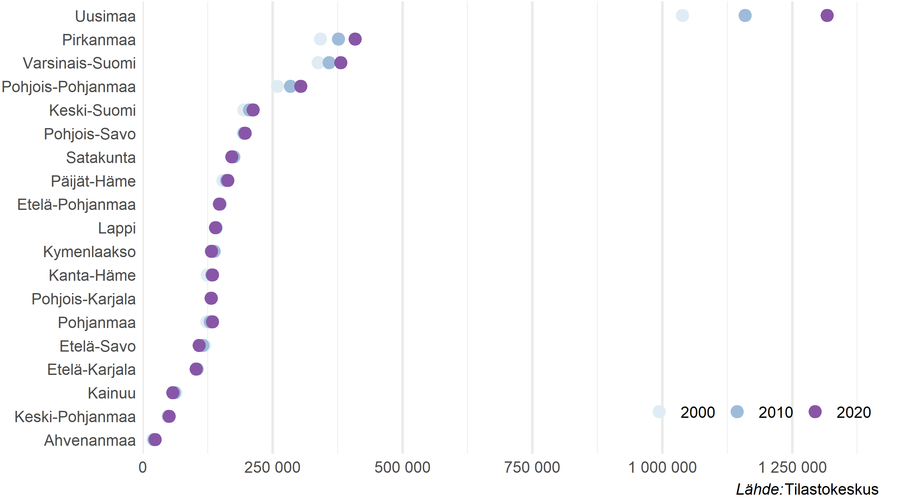

```{r setup, include = T, eval = F}

setwd("~/polku_työkansioon")

knitr::opts_chunk$set(echo = FALSE, message = FALSE, warning = FALSE,
  dev = "png", fig.width = 8, fig.height = 5)

```


## Esityksen tarkoitus

- Antaa käsitys rikosoikeudellisessa vastuussa olevien ikäryhmien jakautumisesta Suomessa maakunnittain 2000-luvulla.
- Rikosoikeudellinen vastuu alkaa 15-vuotiaana. 
- Tarkasteltavat ikäryhmät: 15--17-vuotiaat, 18--20-vuotiaat ja yli 20-vuotiaat.


## Suomen väestö kasvanut hieman 2000-luvun aikana

```{r}

knitr::include_graphics("kokovaesto.png")

```


## Rikosoikeudellisessa vastuussa oleva väestö eli 15 vuotta täyttäneet maakunnittain, määrät

```{r}

knitr::include_graphics("mk_rvpop.png")


```


## Rikosoikeudellisessa vastuussa oleva väestö eli 15 vuotta täyttäneet maakunnittain, jakauma

```{r}

knitr::include_graphics("mk_rvpopdist.png")


```


## Aikuisväestö eli yli 20-vuotiaat lisääntynyt eniten Uudellamaalla

```{r}



```


## Nuorisoikäinen väestö eli 15--20-vuotiaat vähentynyt useimmissa maakunnissa

```{r}

knitr::include_graphics("mk_nuoret.png")

```


## Rikosoikeudellisessa vastuussa olevasta väestöstä eli 15 vuotta täyttäneistä alle 10 % nuorisoikäisiä

```{r}

knitr::include_graphics("ika_rvpopdist.png")

```


## Ennuste: 15--17-vuotiaiden määrä kasvaa lähinnä Uudellamaalla

```{r}

knitr::include_graphics("ennuste.png")

```


## Johtopäätökset

- Rikosoikeudellisessa vastuussa oleva väestö on kasvanut Suomessa 2000-luvun aikana lähinnä aikuisväestön osalta.
- Noin puolet rikosoikeudellisessa vastuussa olevasta väestöstä asuu Uudellamaalla, Pirkanmaalla, Varsinais-Suomessa ja Pohjois-Pohjanmaalla. Väestö kasvanut vain näissä maakunnissa 2000-luvulla.
- Myös aikuisväestön määrä on kasvanut näiden neljän em. maakunnan alueella.
- Nuorisoikäinen väestö (15--20-v.) on lisääntynyt vuodesta 2000 Uudellamaalla. Muiden maakuntien alueella nuorison määrä on pysynyt ennallaan tai vähentynyt.
- Tulevina vuosina 15--17-vuotiaiden määrä tulee kasvamaan Uudellamaalla, muissa maakunnissa nuorten määrä kasvaa enintään hieman tai pysyy ennallaan.
- Tarkastelua mahdollista hienojakoistaa esim. ikäryhmiä tarkentamalla tai sukupuolittaisilla tarkasteluilla.


## Kiitos!


